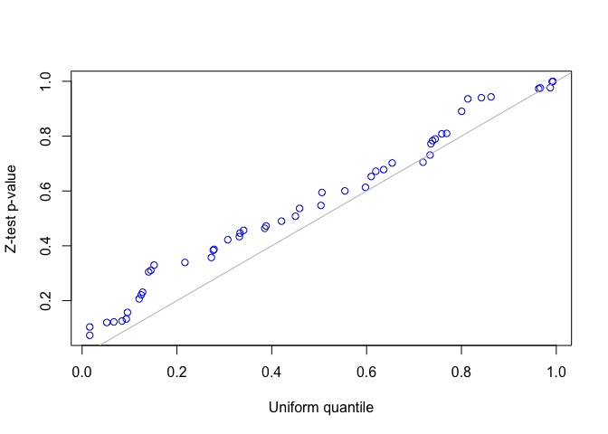
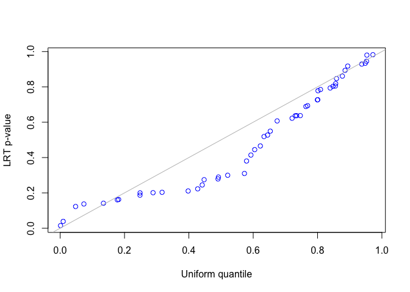

<!-- README.md is generated from README.Rmd. Please edit that file -->

# FLASH-MM

<!-- badges: start -->
<!-- badges: end -->

FLASH-MM is a method (package name: FLASHMM) for analysis of single-cell
differential expression using a linear mixed-effects model (LMM) [^1].
The mixed-effects model is a powerful tool in single-cell studies due to
their ability to model intra-subject correlation and inter-subject
variability.

The FLASHMM package provides three functions: *lmm*, *lmmfit*, and
*flashmm*, for fitting LMMs. The *lmm* function takes summary statistics
as input, whereas *lmmfit* and *flashmm* are a wrapper around *lmm* that
directly processes cell-level data and computes the summary statistics
internally. The *lmmfit* takes the model design matrices as input.
Instead the *flashmm* takes the model formulas as input, where the
design matrices are generated internally. While *lmmfit* and *flashmm*
are easier to use, they have the limitation of higher memory
consumption. For extremely large scale data, we can precompute the
summary-level data, and then use *lmm* function to fit LMMs. FLASHMM
provides *lmmtest* function to perform statistical test on the fixed
effects and the contrasts of the fixed effects.

In summary, FLASHMM package provides the following main functions.

- *lmm*: fit LMM using summary-level data.
- *lmmfit*: fit LMM using model design matrices based on cell-level
  data.
- *flashmm*: fit LMM using model formulas based on cell-level data.
- *lmmtest*: perform statistical tests on the fixed effects and their
  contrasts.
- *contrast.matrix*: construct a contrast matrix of the fixed effects
  for various comparisons.
- *simuRNAseq*: simulate multi-sample multi-cell-type scRNA-seq data.

## Installation

You can install FLASHMM package from CRAN:

``` r
install.packages("FLASHMM")
```

Or the development version from GitHub:

``` r
devtools::install_github("https://github.com/Baderlab/FLASHMM")
```

## Example

This basic example shows how to use FLASHMM for analyzing single-cell
differential expression. See [the package
vignette](https://cran.r-project.org/package=FLASHMM) for details.

``` r
library(FLASHMM)
```

### Simulating scRNA-seq dataset with *simuRNAseq*

Simulate a multi-sample multi-cell-cluster scRNA-seq dataset that
contains 25 samples and 4 clusters (cell types) with 2 treatments.

``` r
set.seed(2412)
dat <- simuRNAseq(nGenes = 50, nCells = 1000, nsam = 25, ncls = 4, ntrt = 2, nDEgenes = 6)
#> Message: the condition B is treated.
names(dat)
#> [1] "ref.mean.dispersion" "metadata"            "counts"             
#> [4] "DEgenes"             "treatment"
```

The simulated data contains

- *counts*: a genes-by-cells matrix of expression counts
- *metadata*: consisting of samples (sam), cell-types (cls) and
  treatments (trt).
- *DEgenes*: differetially expressed (DE) genes.

### Differential expression analysis using LMM

The analyses involve following steps: LMM design, LMM fitting, and
hypothesis testing.

**1. Model design**

``` r
##Gene expression profile: log-transformed counts
Y <- log2(dat$counts + 1) 

##Fixed effects
fixed <- ~ 0 + log(libsize) + cls + cls:trt
X <- model.matrix(fixed, data = dat$metadata)

##Random effects
randomS <- ~ 0 + sam
Z <- model.matrix(randomS, data = dat$metadata)
d <- ncol(Z) 
```

**2. LMM fitting**

**Option 1**: Fit LMMs using model formulas based on cell-level data.

``` r
fit1 <- flashmm(dat$counts, fixed, random = randomS, metadata = dat$meta, is.counts = TRUE)
```

**Option 2**: Fit LMMs using model design matrices based on cell-level
data.

``` r
fit2 <- lmmfit(Y, X, Z, d = d)
identical(fit1, fit2)
#> [1] TRUE
```

**Option 3**: Fit LMMs based on summary-level data.

``` r
##Step 1: computing summary statistics
n <- nrow(X); d <- ncol(Z)
XX <- t(X)%*%X; XY <- t(Y%*%X)
ZX <- t(Z)%*%X; ZY <- t(Y%*%Z); ZZ <- t(Z)%*%Z
Ynorm <- rowSums(Y*Y)

##Step 2: fitting LMMs
fit3 <- lmm(XX, XY, ZX, ZY, ZZ, Ynorm = Ynorm, n = n, d = d)
identical(fit2, fit3)
#> [1] TRUE
```

**3. Hypothesis testing**

``` r
## Testing coefficients (fixed effects)
fit <- fit1
test <- lmmtest(fit)
# head(test) The t-value and p-values are identical with those provided in the
# LMM fit.
range(test - cbind(t(fit$coef), t(fit$t), t(fit$p)))
#> [1] 0 0

fit$p[, 1:4]
#>                     Gene1        Gene2        Gene3        Gene4
#> log(libsize) 0.0003936946 1.226867e-09 0.0003216502 4.036515e-05
#> cls1         0.0158766072 1.300111e-06 0.0209667982 7.686618e-03
#> cls2         0.0095791682 7.060831e-07 0.0248727531 1.220264e-02
#> cls3         0.0106867912 5.971329e-07 0.0319158551 9.862323e-03
#> cls4         0.0145925607 6.556356e-07 0.0266262016 7.087769e-03
#> cls1:trtB    0.3846324624 7.144869e-01 0.8795840264 3.319065e-01
#> cls2:trtB    0.0387066712 2.726210e-01 0.9114719019 4.580478e-01
#> cls3:trtB    0.1322220329 1.338870e-01 0.7144983039 3.745743e-01
#> cls4:trtB    0.7442524470 9.307711e-02 0.6485383570 5.182577e-01

# fit$coef[, 1:4]; fit$t[, 1:4]
```

**Differentially expressed (DE) genes**: The coefficients of the
interactions, cls*i* :trtB, represent the effects of treatment B versus
A in a cell type, cls*i*.

``` r
##Coefficients, t-values, and p-values for the genes specific to a cell-type.
index <- grep(":", rownames(fit$coef))
ce <- fit$coef[index, ]
tv <- fit$t[index, ]
pv <- fit$p[index, ]

out <- data.frame(
    gene = rep(colnames(ce), nrow(ce)), 
    cluster = rep(rownames(ce), each = ncol(ce)),
    coef = c(t(ce)), t = c(t(tv)), p = c(t(pv)))

##FDR.
out$FDR <- p.adjust(out$p, method = "fdr")

##The DE genes with FDR < 0.05
out[out$FDR < 0.05, ]
#>       gene   cluster       coef         t            p          FDR
#> 147 Gene47 cls3:trtB  1.0193230  5.971113 3.279879e-09 3.279879e-07
#> 148 Gene48 cls3:trtB -0.8469024 -4.681093 3.250047e-06 2.166698e-04
#> 150 Gene50 cls3:trtB  0.9981295  6.534829 1.017003e-10 2.034006e-08
```

**Using contrasts**: We can make comparisons using contrasts. For
example, the effects of treatment B vs A in all clusters can be tested
using the contrast constructed as follows.

``` r
ct <- numeric(ncol(X))
index <- grep("B", colnames(X))
ct[index] <- 1/length(index)

test <- lmmtest(fit, contrast = ct)
head(test)
#>             _coef         _t        _p
#> Gene1  0.13626884  1.4753256 0.1404426
#> Gene2  0.14907532  1.4540794 0.1462409
#> Gene3 -0.03055443 -0.2900354 0.7718498
#> Gene4  0.14832802  0.9531558 0.3407436
#> Gene5 -0.17465354 -1.3918602 0.1642770
#> Gene6  0.09747653  1.1553425 0.2482287
```

## And More

### Using ML method

To use the maximum likelihood (ML) method to fit the LMM, set method =
‘ML’.

``` r
##Fitting LMM using ML method
fit1 <- lmmfit(Y, X, Z, d = d, method = "ML")
```

### LMM with two-component random effects

If appropriate, for example, we also take account of the measurement
locations as a random effect, we may fit data using the LMM with
two-component random effects.

``` r
## Two-component random effects: Suppose the data contains different
## measurement locations within a sample, denoted as 'location', which are
## randomly generated.
set.seed(2508)
dat$metadata$location <- sample(LETTERS[1:25], nrow(X), replace = TRUE)
randomL <- ~0 + location
Zl <- model.matrix(randomL, data = dat$metadata)
d <- c(ncol(Z), ncol(Zl))

## Fit the LMM with two-component random effects.
fit2 <- lmmfit(Y, X, Z = cbind(Z, Zl), d = d, method = "ML")
fit3 <- flashmm(Y, fixed, random = list(randomS, randomL), metadata = dat$metadata,
    method = "ML")
identical(fit2, fit3)
#> [1] TRUE
```

### Testing variance components

We use both z-test and likelihood ratio test (LRT) to test the second
variance component in the LMM with two-component random effects. Since
the simulated data was generated by the LMM with single-component random
effects, the second variance component should be zero. For the LRT test,
the two nested models must be fitted using the same method, either REML
or ML, and use the same design matrix, $X$, when using REML method.

``` r
##(1) z-test for testing the second variance component
##Z-statistics for the second variance component
i <- grep("var2", rownames(fit2$theta)) 
z <- fit2$theta[i, ]/fit2$se.theta[i, ] 
##One-sided z-test p-values for hypotheses:
##H0: theta <= 0 vs H1: theta > 0
p <- pnorm(z, lower.tail = FALSE)

##(2) LRT for testing the second variance component
LRT <- 2*(fit2$logLik - fit1$logLik)
pLRT <- pchisq(LRT, df = 1, lower.tail = FALSE)

##QQ-plot
qqplot(runif(length(p)), p, xlab = "Uniform quantile", ylab = "Z-test p-value", col = "blue")
abline(0, 1, col = "gray")
```



``` r
qqplot(runif(length(pLRT)), pLRT, xlab = "Uniform quantile", ylab = "LRT p-value", col = "blue")
abline(0, 1, col = "gray")
```



``` r
sessionInfo()
#> R version 4.4.3 (2025-02-28)
#> Platform: x86_64-apple-darwin20
#> Running under: macOS Monterey 12.7.6
#> 
#> Matrix products: default
#> BLAS:   /Library/Frameworks/R.framework/Versions/4.4-x86_64/Resources/lib/libRblas.0.dylib 
#> LAPACK: /Library/Frameworks/R.framework/Versions/4.4-x86_64/Resources/lib/libRlapack.dylib;  LAPACK version 3.12.0
#> 
#> locale:
#> [1] en_US.UTF-8/en_US.UTF-8/en_US.UTF-8/C/en_US.UTF-8/en_US.UTF-8
#> 
#> time zone: America/Toronto
#> tzcode source: internal
#> 
#> attached base packages:
#> [1] stats     graphics  grDevices utils     datasets  methods   base     
#> 
#> other attached packages:
#> [1] FLASHMM_1.2.3
#> 
#> loaded via a namespace (and not attached):
#>  [1] vctrs_0.7.1       cli_3.6.5         knitr_1.51        rlang_1.1.7      
#>  [5] xfun_0.56         processx_3.8.6    otel_0.2.0        purrr_1.2.1      
#>  [9] pkgload_1.4.1     glue_1.8.0        htmltools_0.5.9   ps_1.9.1         
#> [13] pkgbuild_1.4.8    formatR_1.14      rmarkdown_2.30    grid_4.4.3       
#> [17] evaluate_1.0.5    MASS_7.3-65       ellipsis_0.3.2    fastmap_1.2.0    
#> [21] yaml_2.3.12       lifecycle_1.0.5   memoise_2.0.1     compiler_4.4.3   
#> [25] fs_1.6.6          sessioninfo_1.2.3 rstudioapi_0.18.0 lattice_0.22-7   
#> [29] digest_0.6.39     R6_2.6.1          curl_7.0.0        usethis_3.2.1    
#> [33] callr_3.7.6       magrittr_2.0.4    Matrix_1.7-4      tools_4.4.3      
#> [37] devtools_2.4.6    desc_1.4.3        cachem_1.1.0      remotes_2.5.0
```

# Citation

If you find FLASH-MM useful for your publication, please cite:

[^1]: Xu, C., Pouyabahar, D., Voisin, V. et al. FLASH-MM: fast and
    scalable single-cell differential expression analysis using linear
    mixed-effects models. Nat Commun 17, 2384 (2026).
    <https://doi.org/10.1038/s41467-026-69063-2>
